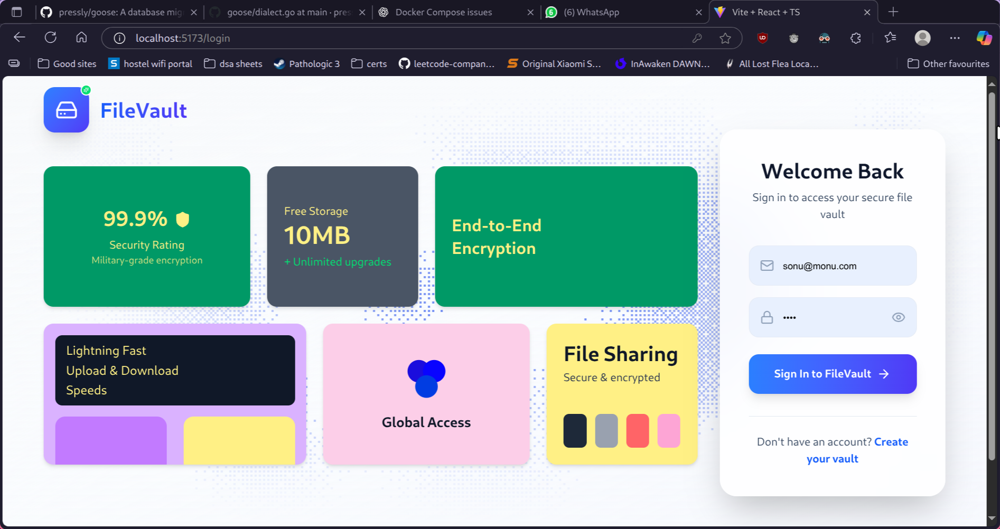
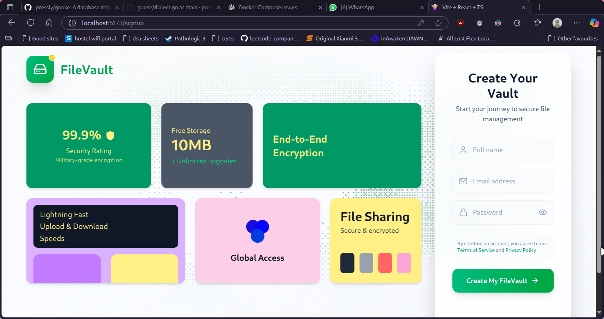
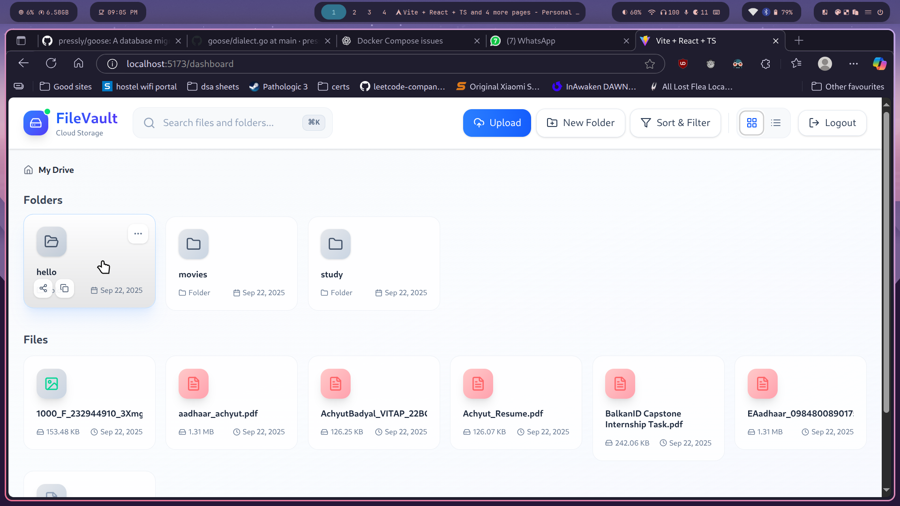
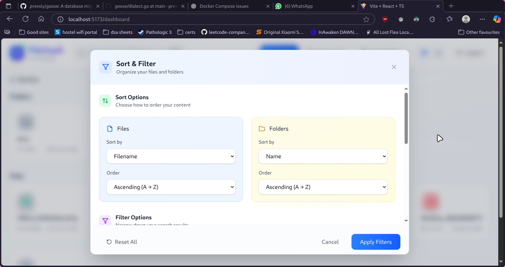
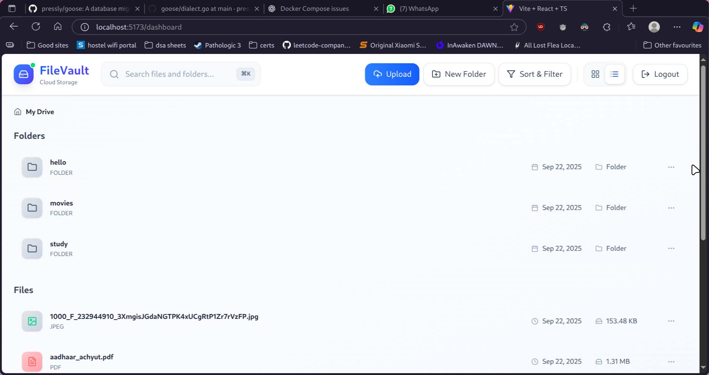
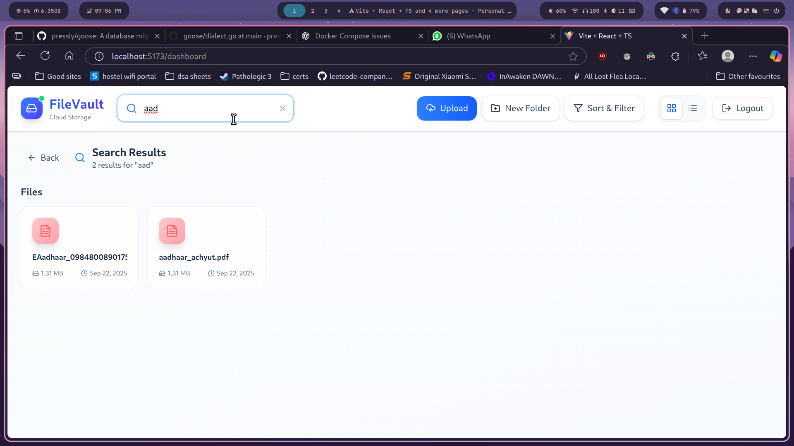
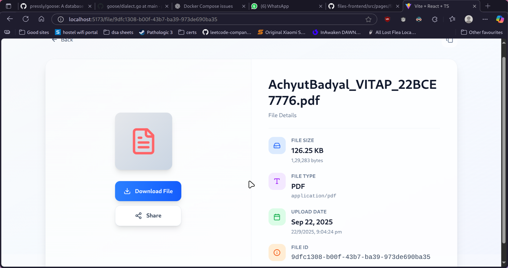

# @YuanziX/files-frontend

A modern frontend application for managing files, built with React and TypeScript. This project serves as the user interface for the [files-backend](https://github.com/YuanziX/files-backend) and enables seamless file operations such as upload, download, sharing and querying.

## Features

- 📁 **File Management:** Upload, download, preview, and organize files.
- 🔍 **Powerful Search:** Find files quickly with advanced filtering and search options.
- 👥 **User Authentication:** Secure login and registration flows.
- 🔗 **Sharing:** Share files and folders with others via links or permissions.
- 🌐 **API Integration:** Communicates with the files-backend GraphQL API for all data operations.

## Screenshots

<div align="center">
  
  
  
  
  
  
  
</div>

## Project Structure

```
src/
  components/    # Reusable React components
  pages/         # Page-level components
  hooks/         # Custom React hooks
  utils/         # Utility functions
  assets/        # Static assets (images, icons)
  App.tsx        # Root app component
  index.tsx      # Entry point
```

## Scripts

- `npm start` — Start the development server
- `npm run build` — Build for production
- `npm test` — Run tests

## Contributing

Contributions are welcome! Please open issues or submit pull requests for improvements or bug fixes.

## Related Projects

- [files-backend](https://github.com/YuanziX/files-backend)
- [files-admin-frontend](https://github.com/YuanziX/files-admin-frontend)
